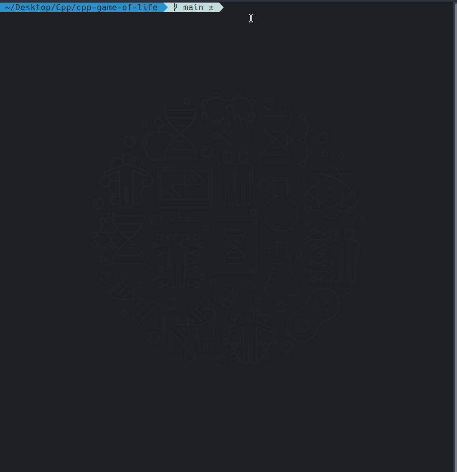
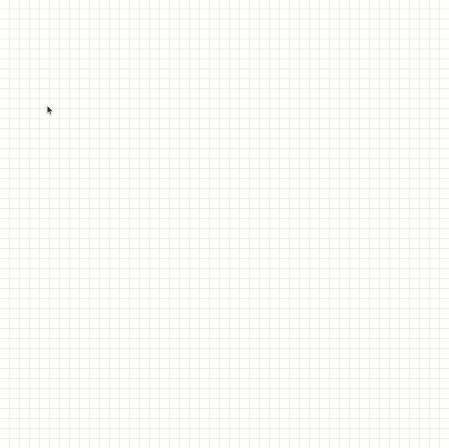

# cpp-game-of-life
Simple implementation of [Conway's Game of Life](https://en.wikipedia.org/wiki/Conway's_Game_of_Life) using C++ and SDL2.

## Setup
To run this project, you need to install SDL2 and then:
```
make all
```

## How to play
1st stage (user input):
 - Draw initial state with mouse clicks
 - Press ESC to clear the board
 - Press enter/spacebar to start the game

2nd stage (game):
 - Press enter/spacebar to pause/unpause the game
 - Press ESC to end the game and return to 1st stage

To quit the program press windows title bar X button

## Examples

### Example 1


### Example 2 - [Gosper glider gun](https://en.wikipedia.org/wiki/Gun_(cellular_automaton))
